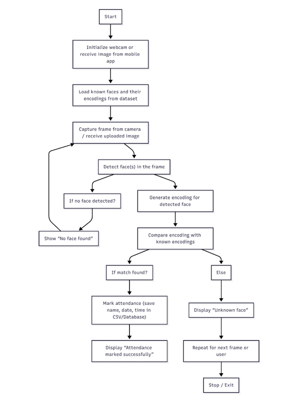
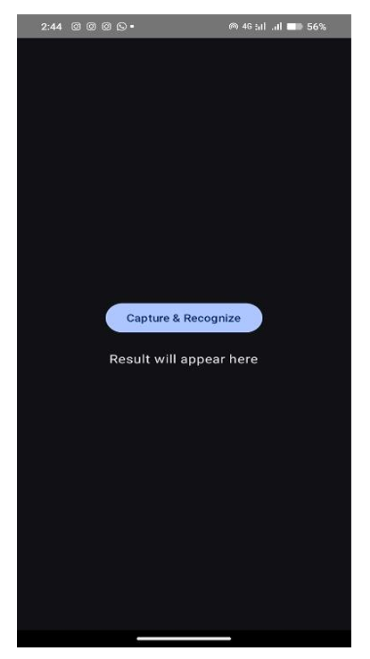
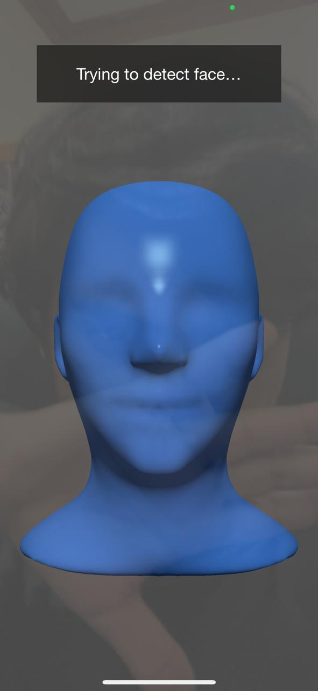
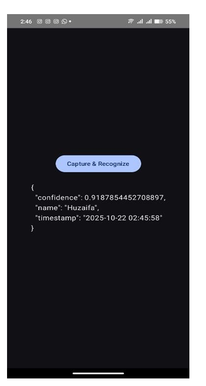
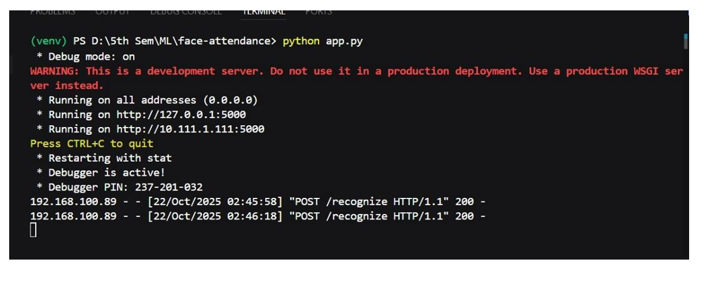
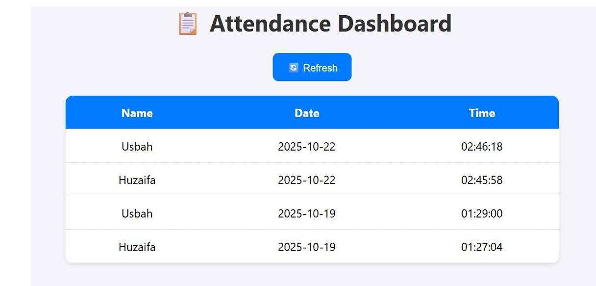

# 📸 Facial Recognition Based Attendance System

*(Machine Learning Project)*

**Developed by:** Muhammad Huzaifa & Usbah Saleem 

## 📖 Introduction
The **Facial Recognition Attendance System** is an AI-powered project designed to automate the attendance process using advanced facial recognition technology. It aims to replace traditional manual and physical biometric systems with a fast, contactless, and highly reliable solution that detects and recognizes faces using computer vision and deep learning.

The system utilizes a **Flask** backend for API processing and a **Kivy/KivyMD-based Mobile Application** for image capturing. A user captures their image via the mobile app, which is then sent to the Flask server. The server processes the image, extracts facial features, predicts the user's identity, and seamlessly logs the attendance into an SQLite database.

## 🎯 Objectives
- Automate attendance marking using facial recognition.
- Eliminate proxy attendance and manual data entry errors.
- Create a real-time, contactless, and hygienic attendance system.
- Provide a scalable architecture that can be deployed locally and expanded for larger institutional use.

## 🚀 Features
- **Real-Time Face Detection & Recognition**: Powered by PyTorch (`facenet-pytorch`) using MTCNN for face detection and InceptionResnetV1 for extracting high-quality face embeddings.
- **Accurate Classification**: Uses a Support Vector Machine (SVM) model trained on custom face dataset encodings for robust face classification.
- **API-First Design**: Flask provides a REST API (`/recognize`) to handle image uploads and return prediction responses.
- **Cross-Platform Mobile App**: Built with Kivy and KivyMD, allowing Android users to easily capture and log attendance right from their phone.
- **Automated Database Logging**: Identified users are automatically logged into an SQLite database with their names, timestamps, and dates. Prevents duplicate attendance logging within the same day.

## Screenshots





"Backend Database"



## 💻 Tech Stack
**Frontend / Mobile Application**
- **Python Frameworks**: Kivy, KivyMD
- **Libraries**: Plyer (for camera access), Requests (for API communication)

**Backend / Machine Learning**
- **Web App Framework**: Flask
- **Deep Learning**: PyTorch, `facenet-pytorch` (MTCNN, InceptionResnetV1)
- **Machine Learning**: `scikit-learn` (SVM, LabelEncoder), Joblib
- **Computer Vision & Processing**: OpenCV (`cv2`), Pillow (`PIL`), NumPy, Pandas
- **Database**: SQLite3


## 📂 Project Structure
```
FacialRecognitionAttendance/
│
├── app.py                 # Main Flask application (handles API and recognition)
├── main.py                # Mobile Application entry point (Kivy/KivyMD UI)
├── encode_faces.py        # Script to process dataset and train/encode known faces (Mentioned in instructions)
├── init_db.py             # Script to initialize the SQLite database
├── scripts/
│   └── attendance.db      # SQLite database where attendance records are kept
├── models/
│   ├── svm_model.joblib   # Trained SVM prediction model
│   └── label_encoder.joblib # Trained label encoder mapped to face names
├── dataset/               # Folder storing registered user face images
├── requirements.txt       # Python dependencies
└── README.md              # Project documentation file
```

## 🛠️ How to Run

### Step 1: Clone or Download the Repository
Open your terminal or command prompt and navigate to the project directory.

### Step 2: Install Dependencies
Ensure you have Python installed. Run the following command to download all required packages:
```bash
pip install -r requirements.txt
```
*(If you do not have a requirements file, you can install the core libraries manually: `pip install flask torch facenet-pytorch scikit-learn opencv-python numpy pandas pillow kivy kivymd plyer requests`)*

### Step 3: Train / Encode Known Faces (First-Time Setup)
Before starting the system, you need to prepare your face encodings.
Place photos of the individuals you want recognized in the `dataset/` folder, then run the encoding script to generate `svm_model.joblib` and `label_encoder.joblib`.
```bash
python encode_faces.py
```

### Step 4: Initialize the Database (If required)
To create the SQLite database table that stores the attendance logs:
```bash
python init_db.py
```

### Step 5: Start the Flask Server
Run the Flask backend server:
```bash
python app.py
```
The server will start running locally (e.g., `http://0.0.0.0:5000/`). **Note down your local machine's IP address** (e.g., `192.168.100.21`) if you are connecting from a mobile phone.

### Step 6: Connect the Mobile Application
1. Open the `main.py` file.
2. Search for the API URL configuration (around line 22):
   ```python
   url = "http://192.168.100.21:5000/recognize"
   ```
3. **Change the IP address** to match the local IPv4 address of the computer running the Flask server. Ensure both your computer and mobile phone are connected to the exact same Wi-Fi network.
4. Run the mobile application:
   ```bash
   python main.py
   ```
*(Note: Use Buildozer with the provided `buildozer.spec` if you wish to compile an APK file for Android.)*

### Step 7: Test Attendance
- Open the mobile application UI.
- Click **"Capture & Mark Attendance"**.
- Your camera will open. Take a clear picture of your face.
- The app will send the image to the Flask server, and your name, confidence level, and timestamp will appear on the screen!
- An entry will also be recorded in the `attendance.db` database.

## 📊 Results and Evaluation
The system demonstrated highly reliable accuracy during testing in well-lit conditions. The integration with MTCNN and InceptionResnetV1 allows robust extraction of facial vectors, translating into fast (< 2 seconds) inferences per user.

## 🚧 Future Improvements
- Deploy the Flask server to an online cloud platform (e.g., AWS, Heroku, Render) for universal access without local network constraints.
- Build a dedicated Administrator Dashboard (Web App) to easily view, export, and analyze attendance charts.
- Adapt the system to support continuous live video stream recognition instead of single image captures.
